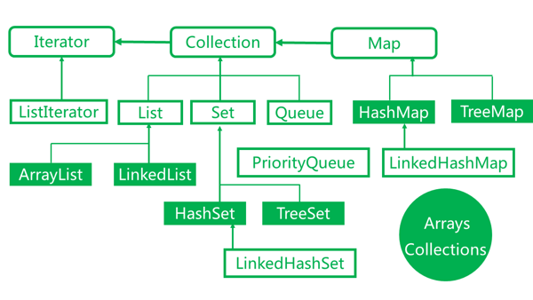

# Collections




``` plain
├── Collection
│   ├── List
│   │   ├── ArrayList
│   │   └── LinkedList
│   Set
│   ├── HashSet
│   └── LinkedHashSet
└── Map
    ├── HashMap
    └── WeakHashMap
```

< image> 

常见就是

* ArrayList
* HashSet
* HashMap

然后

* TreeMap
* TreeSet
* LinkedList

并发 几个

weakHashmap


Class | Foundation | Operation | Big O | Explanation
--- | --- | --- | --- | --- 
**ArrayList** | **Resizable** Array | add(elem) | O(1)/O(n) | 末尾加 & resize
| | | add(index,elem) | O(n) | traverse, then move subarray & resize
| | | addAll(collection) | O(m)/O(n+m) | resize
| | | contains(obj) | O(n) | traverse
| | | get(index) | O(1)
| | | remove(index) | O(n) | move whole subarray
| | | set(index,elem) | O(1)
| | | size() | O(1)
||| iterator.remove()|O(n)
|||listIterator.add(elem)|O(n)
| |
**HashSet** | hash & linkedlist (a HashMap instance)| add(elem) | O(1) 
|| | contains(obj) | O(1)
|||isEmpty() | O(1)
|||remove(obj) | O(1)
||| size() | O(1)
|||add(elem) | O(1)/O(n) | rehash
|||
**LinkedList** | **doubly-linked** list | add(elem) | O(1)
|||add(index,elem)|O(1) | doubly的才保证可以直接往末尾加
|||addAll(collection)|O(1)
|||addAll(index,collection)|O(n+m)|find first, then traverse to the end of inserted linked list
|||contains(elem)|O(n)
|||get(index)|O(n)
|||remove(index)|O(n)
||| remove(obj) | O(n)
|||iterator.remove() | O(1)
||| listIterator.add(elem)|O(1)
||FIFO/QUEUE operations| offer(elem)|O(1)
|||poll()|O(1)
|||peek()|O(1)


null is available to arraylist, hashset, linkedlist, and they are all not synchronized

Permit Null element:

* ArrayList
* HashSet
* LinkedList

Null element not allowed:

* ArrayDeque

常用ArrayList,HashSet, TreeMap, TreeSet都 are all not synchronized

Hashset: 有个 capacity// TODO when to rehash

it's very important not to set the initial **capacity** too high (or the load factor too low) if iteration performance is important

* too high：要不然内存地址无法连续，损耗也挺大
* too low：冲突太多

//TODO capacity & load factor 如何设置？

LinkedList元素太散，实际 performance 不一定比  ArrayList 就高很多
### adfasdf
hashset 其实是个 map

* ArrayList, HashSet, HashMap is NOT synchronized

ArrayList 默认自增一半长度

HashMap允许在Key和Value中都出现null值

有些 key，value 不允许 null 啊，会直接抛出 NullPointerException

### HashSet

HashSet本质上是一个Collection，类似于List，是列表/集合，不是K-V的Map，但是它骨子里是一个HashMap……

这么说可能会更易于理解：
HashSet对外是“类”的集合，实际上是内部维护了一个HashMap进行实现。

实际上存储的是两个：**hashCode和类本身**（字符串/自定义类等）。

HashSet进行add的时候，会先进行验证hashCode：
(HashSet进行add操作实际上是对Map的put操作)

就是 `hashCode(instance) -> instance`

拿就是直接用`hashcode(instance)`去 map 里找

判断 instance 是否 identical，是要看`hashcode`和`equals()`
> HashSet 判断两个对象相等的标准除了要求通过 equals() 方法比较返回 true 之外，还要求两个对象的 hashCode() 返回值相等。而上面程序没有重写 Name 类的 hashCode() 方法，两个 Name 对象的 hashCode() 返回值并不相同，因此 HashSet 会把它们当成 2 个对象处理，因此程序返回 false。如果想返回true，需要重写equals方法和hashCode方法。

``` java
public V put(K key, V value) {
    if (table == EMPTY_TABLE) {
        inflateTable(threshold);
    }
    if (key == null)
        return putForNullKey(value);
    int hash = hash(key);//本函数里有hashCode
    int i = indexFor(hash, table.length);
    for (Entry<K,V> e = table[i]; e != null; e = e.next) {
        Object k;
        if (e.hash == hash && ((k = e.key) == key || key.equals(k))) {
            V oldValue = e.value;
            e.value = value;
            e.recordAccess(this);
            return oldValue;
        }
    }

    modCount++;
    addEntry(hash, key, value, i);
    return null;
}
```

2). 开发中的建议
(1). 自定义对象，一定要重写hashCode和equals两个方法
       如果不重写，则默认的本地方法hashCode【OS来产生】会产生值都不一样的hashCode，即使内容重复的元素也会被添加到HashSet中，无法保证元素的唯一性。
【注意】开发中重写这两个方法，方便集合框架的底层调用这些方法。
(2). 建立高效的hashCode会使得hashSet添加元素的过程更为高效。
       hashCode的值不同，则调用equals()方法比较的环节便可以省去。

[1]. HashSet判断、删除和添加元素等操作依据的是被操作元素所在的类的hashCode()和equals( )这两个方法。
[2]. ArrayList做同等的操作，依据的仅仅是equals( )方法

常见容器与工具类

ArrayList

数据结构采用的是线性表，优势是访问和查询十分方便，但添加和删除的时候效率很低。

LinkedList

数据结构采用的是链表，优势是删除和添加的效率很高，但随机访问元素时效率较ArrayList类低。

HashSet

数据结构采用的是散列表，主要是设计用来做高性能集运算的，例如对两个集合求交集、并集、差集等。集合中包含一组不重复出现且无特性顺序的元素。其值是不可重复与无序的。

TreeSet

数据结构使用的是红黑树，**性能上低于HashSet，用于排序**。

HashMap

数据结构使用的是散列表，是最常用的是Collection

TreeMap

与TreeSet同理，用于排序。

Arrays、Collections

这两者可以理解成工具类，提供一些处理容器类静态方法，比如二分查找，排序等等。


ArrayList VS LinkedList

因为Array是基于索引(index)的数据结构，它使用索引在数组中搜索和读取数据是很快的。Array获取数据的时间复杂度是O(1),但是要删除数据却是开销很大的，因为这需要重排数组中的所有数据。

相对于ArrayList，LinkedList插入是更快的。因为LinkedList不像ArrayList一样，不需要改变数组的大小，也不需要在数组装满的时候要将所有的数据重新装入一个新的数组，这是ArrayList最坏的一种情况，时间复杂度是O(n)，而LinkedList中插入或删除的时间复杂度仅为O(1)。ArrayList在插入数据时还需要更新索引（除了插入数组的尾部）。

类似于插入数据，删除数据时，LinkedList也优于ArrayList。

LinkedList需要更多的内存，因为ArrayList的每个索引的位置是实际的数据，而LinkedList中的每个节点中存储的是实际的数据和前后节点的位置。


常用的声明方式（使用静态代码块）：

``` java
public class Test {
    public final static Map map = new HashMap();

    static {
        map.put("key1", "value1");
        map.put("key2", "value2");
    }
}
```

一种简约的方式：

``` java
public class Test {
    public final static Map map = new HashMap() {
        {
            put("key1", "value1");
            put("key2", "value2");
        }
    };
}
```

这种方式，相当于重载HashMap的一个匿名实现，向原有的HashMap中添加了一个匿名构造方法。

另外附加一个List/Set变量的声明方式：

``` java
public class Test {
    public final static List list = Arrays.asList("elment1", "element2");
}
```

## Collection Method

Common:

* add(Element)
* contains(Object)
* isEmpty()
* iterator()
* remove(Object)
* size()

rare

* addAll(Collection)
* containsAll(Collection)
* removeAll(Collection)


## Reference
1. [HashMap，HashSet，Hashtable，Vector，ArrayList 的关系](http://segmentfault.com/a/1190000002900115)
2. [Java 容器知识整理](http://segmentfault.com/a/1190000002903035)
