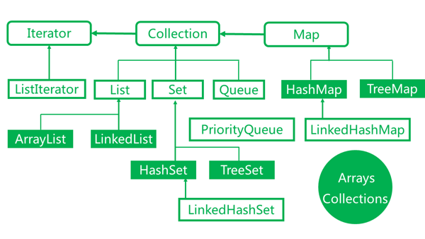

# Collections




``` plain
├── Collection
│   ├── List
│   │   ├── ArrayList **
│   │   └── LinkedList
│   Set
│   ├── HashSet **
│   └── TreeSet *
└── Map
    ├── HashMap **
    ├── TreeMap *
    └── WeakHashMap
```

## Summary

 **Methods**

* Common:
	* add(Element)
	* contains(Object)
	* isEmpty() -> O(1)
	* iterator() -> O(1)
	* remove(Object)
	* size() -> O(1)
* rare
	* addAll(Collection)
	* containsAll(Collection)
	* removeAll(Collection)

**Not synchronized**

* ArrayList
* HashSet
* LinkedList
* TreeSet

**Null element**

* Null allowed
	* ArrayList
	* HashSet
	* LinkedList
* Null not allowed (will throw NullPointerException)
	* ArrayDeque

### Big O

Class | Foundation | Operation | Big O | Explanation
--- | --- | --- | --- | --- 
**ArrayList** | **Resizable** Array | add(elem) | O(1)/O(n) | 末尾加 & resize
| | | add(index,elem) | O(n) | traverse, then move subarray & resize
| | | addAll(collection) | O(m)/O(n+m) | resize
| | | contains(obj) | O(n) | traverse
| | | get(index) | O(1)
| | | remove(index) | O(n) | move whole subarray
| | | set(index,elem) | O(1)
||| iterator.remove()|O(n)
|||listIterator.add(elem)|O(n)
| |
**HashSet** | hash & linkedlist (a HashMap instance)| add(elem) | O(1)/O(n) | rehash 
|| | contains(obj) | O(1)
|||remove(obj) | O(1)
|||
**LinkedList** | **doubly-linked** list | add(elem) | O(1) | doubly的才保证可以直接往末尾加, singly可以直接往前面加应该
|||add(index,elem)|O(n) | 
|||addAll(collection)|O(1)
|||addAll(index,collection)|O(n+m)|find first, then traverse to the end of inserted linked list
|||contains(elem)|O(n)
|||get(index)|O(n)
|||remove(index)|O(n)
||| remove(obj) | O(n)
|||iterator.remove() | O(1)
||| listIterator.add(elem)|O(1)
||FIFO/QUEUE operations| offer(elem)|O(1)
|||poll()|O(1)
|||peek()|O(1)
|||
**TreeSet**|red-black tree|add(elem)|O(logn)
|||remove(elem)|O(logn)
|||contains(elem)|O(logn)

HashSet中的分析是基于 hash 冲突少的原则，否则一个 bucket 上太多 element，效率会很低


### LinkedList or ArrayList

LinkedList

* Pros:
	* `Iterator.remove()`或者`ListIterator.add(e)`消耗小，但是`remove()`还是需要遍历（O(n)）
	* 不需要 resize，无法预知 size 使用 LinkedList **理论**上比较好
* Cons:
	* 有多余的 next reference
	* 对 memory cache 不太友好
	* 每个 node 在内存地址上不连续

ArrayList

* Pros:
	* index 直接访问
* Cons:
	* 可能需要 resize (1.5 times the size)
	* 直接访问

**二者 add() & remove() 都是 O(n)**

理论上

* **iterate 的时候**，要进行 add 或者 remove -> LinkedList
* size 无法预知，可能非常大的时候 -> LinkedList (no resize needed)
* random get -> ArrayList

实际中 LinedList 基本不用，只是理论上效率更好

LinkedList **主要 benefit 是 iterator.remove/add**，直接 remove 跟 ArrayList 差不多，ArrayList 的好处是成块成块，真实中效率不一定会太差

### HashSet 

实际就是 Array+LInkedList 

1. hashValue = hash(element)
2. save element @ array[hashValue] bucket
	* each bucket has a linked list. Newly added element will put at the **end** of the list

减少冲突才能保证 HashSet 各个操作能达到O(1)，所以 hash algorithm 很重要。实际中直接使用 IDE 自带 generate hashCode()，一般会用到一个 prime 质数

##### `hashCode()` & `equals()`
> Equals is always called **after** the hashCode method in a java hashed collection while adding and removing elements. The reason being, if there is an element already at the specified bucket, then JVM checks whether it is the same element which it is trying to put. In case if the equals returns false then the element is added to the same bucket but at the end of list at the bucket. So now you just dont have a single element at the same bucket but a list of elements.

> Now while retrieving the element, first hashCode will be called to reach the desired bucket and then the list will be scanned using the equals to fetch the desired element.

> The ideal implemenation of hashCode will make sure the size of list at each bucket is 1. And hence the retrieval of elements is done using O(1) complexity. But if there are mulitple elements stored in the list at a bucket, then the retreival of element will be done by O(n) complexiy, where n is the size of the list.

> Btw in case of HashSet there is no list created at the bucket, rather the object is simply replaced if hashcode and equals are same. The ist creation behavior is in hashmap.

> [http://stackoverflow.com/questions/17919464/hashcode-and-equals-method](http://stackoverflow.com/questions/17919464/hashcode-and-equals-method)


* `hashCode()`比`equals()`会先使用
* `contains()`也是，如果hash 不一样，直接 return false。（fail fast）

建立高效的hashCode会使得hashSet添加元素的过程更为高效。hashCode的值不同，则调用equals()方法比较的环节便可以省去。ArrayList做同等的操作，依据的仅仅是equals( )方法。

``` java
class Custom{
	AnotherCustom another;
}
```

`Custom`和`AnotherCustom`都需要覆写`hashCode()`

##### capacity & load factor
* **max elements = capacity * load factor**
* default load factor = 0.75
* default initial capacity = 12
* if max elements are reached, capacity will be **doubled**

> You need a size/load-factor to avoid a resize. Note: it will always be the next power of 2 for HashSet & HashMap.

* load factor
	* too high: decrease the space but increase the lookup cost (一直在 linkededlist 上找，相当于遍历)
	* too low: the opposite
* initial capacity
	* too high: space 大，不连续，lookup 效率不好
	* too low: 冲突太多

> The expected number of entries in the map and its load factor should be taken into account when setting its initial capacity, so as to minimize the number of rehash operations. If the initial capacity is greater than the maximum number of entries divided by the load factor, no rehash operations will ever occur.

##### HashSet & HashMap
HashSet对外是“类”的集合 Collection，实际上是内部维护了一个HashMap进行实现。

实际上存储的是两个：**hashCode**和**类本身**（字符串/自定义类等）。

就是 `hashCode(instance) -> instance`，拿就是直接用`hashcode(instance)`去 map 里找

HashSet进行add的时候，会先进行验证hashCode：(HashSet进行add操作实际上是对Map的put操作)


### TreeSet
基于 red-black tree，主要操作的复杂度就是 tree height：O(logn)

红黑树add，remove 都会 adjust 自身的 height，是一个平衡的二叉树

数据结构使用的是红黑树，**性能上低于HashSet，用于排序**。

##### Sort
默认使用 natural ordering：小的在前

**TreeSet排序根本不会用到`hashCode()`& `equals()`**

`contains()`用的是`compareTo()`来判断的

想象一下，整个tree 的操作就是用 compare 的操作来 add，remove，contains 的

``` java
class Custom implements Comparable{
    @Override
    public int compareTo(Object o) {
        return 0;
    }
}
```

or

``` java
new TreeSet(customComparator)

class CustomComparator implements Comparator {

    @Override
    public int compare(Object o1, Object o2) {
        return 0;
    }
}
```

compare

1. return negative: 本身或者前者小
2. return 0：相同
3. return positive：...


### ArrayDeque

 推荐替代 LinkedList 和 Stack

* offer()
* poll()
* push()
* pop()
* ~~add()~~: ArrayDeque继承 Collection，不推荐使用`add()`


## Some methods

Arrays、Collections: 这两者可以理解成工具类，提供一些处理容器类静态方法，比如二分查找，排序等等。

``` java
Arrays.toString(int[] integers)

List list = Arrays.asList("elment1", "element2");
```


常用的声明方式（使用静态代码块）：

``` java
public class Test {
    public final static Map map = new HashMap();

    static {
        map.put("key1", "value1");
        map.put("key2", "value2");
    }
}
```

一种简约的方式：

``` java
public class Test {
    public final static Map map = new HashMap() {
        {
            put("key1", "value1");
            put("key2", "value2");
        }
    };
}
```

这种方式，相当于重载HashMap的一个匿名实现，向原有的HashMap中添加了一个匿名构造方法。

## Reference
[big o cheat sheet](http://bigocheatsheet.com/)